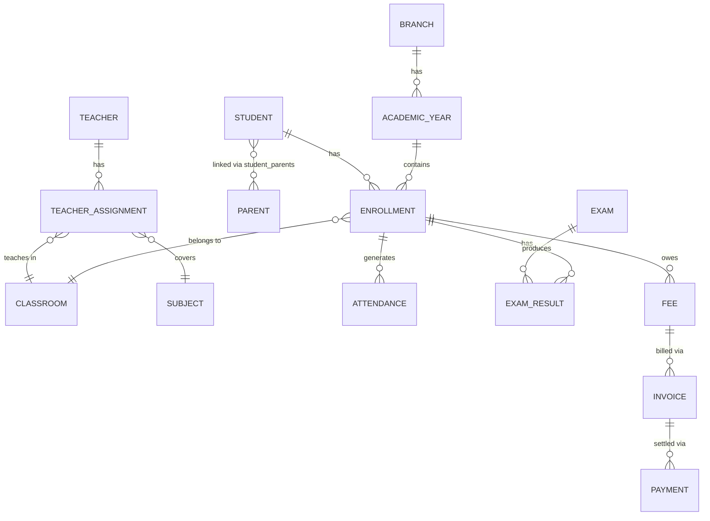

# Entity Relationship Model (ERM)

## الهدف
يوضح هذا المستند الكيانات الأساسية في EduCore والعلاقات بينها كنموذج منطقي مستقل عن نوع قاعدة البيانات.

## الكيانات الأساسية
- Branch
- AcademicYear
- Stage
- Grade
- Program
- Classroom
- Subject
- Teacher
- Student
- Parent
- Enrollment
- TeacherAssignment
- Attendance
- Timetable
- Exam
- ExamResult
- Fee
- Invoice
- Payment
- Role
- Permission
- AuditLog
- Notification

## العلاقات الرئيسية
- Branch يمتلك Academic Years.
- Academic Year يحتوي على Classrooms وEnrollments.
- Student يمتلك Enrollments متعددة عبر الأعوام.
- Enrollment يربط Student مع Classroom.
- TeacherAssignment يربط Teacher مع Subject وClassroom.
- Attendance يرتبط بـ Enrollment وTimetable.
- Payments ترتبط بـ Invoice الخاصة بالطالب.

## Schema الفعلي
تفاصيل الأعمدة، الأنواع، المفاتيح الأساسية والخارجية، والفهارس موثقة بالكامل في
schema.md.

هذا الملف يبقى كنموذج منطقي مختصر للعلاقات، بينما
schema.md

هو المرجع القابل للتنفيذ مباشرة.

## ER Diagram
