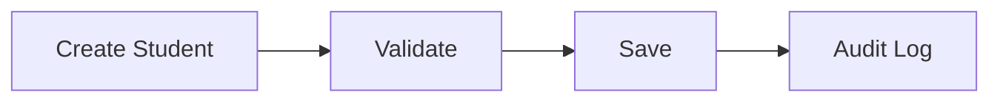

# Student Specification

## Overview
تمثل وحدة الطلاب المصدر الرئيسي لإدارة بيانات الطلاب داخل EduCore، وتشمل دورة حياة الطالب منذ التسجيل وحتى التخرج أو الانسحاب.

## Business Rules
- لكل طالب رقم تعريفي فريد.
- لا يمكن تسجيل طالب بدون سنة دراسية وصف دراسي.
- يحتفظ النظام بسجل تاريخي للتعديلات المهمة.

## Functional Requirements
- إنشاء طالب.
- تعديل بيانات الطالب.
- نقل الطالب بين الصفوف.
- إيقاف أو إعادة تفعيل الطالب.
- البحث والتصفية.

## Non-Functional Requirements
- زمن استجابة أقل من ثانيتين للعمليات الشائعة.
- تسجيل جميع العمليات الحساسة في Audit Log.

## Data Model
- Student
- Parent
- Enrollment
- AcademicYear

## API Contracts
- GET /students
- GET /students/{id}
- POST /students
- PUT /students/{id}
- DELETE /students/{id} — تعطيل أو حذف منطقي (Soft Delete) فقط، طبقاً لـ BR-0804 وPP-004 No Data Loss

## UI Requirements
- قائمة الطلاب.
- صفحة التفاصيل.
- نموذج إنشاء وتعديل.

## Acceptance Criteria
- إنشاء طالب جديد بنجاح.
- منع البيانات غير الصحيحة.
- احترام صلاحيات المستخدم.

## Mermaid Diagram
