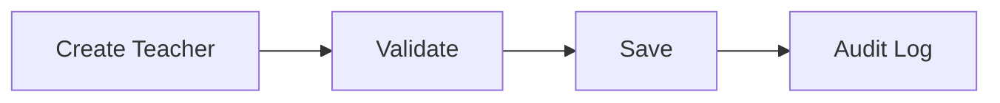

# Teacher Specification

## Overview
تمثل وحدة المعلمين المرجع الرئيسي لإدارة بيانات المعلمين، وتعيينهم للأقسام والمواد والجداول الدراسية داخل EduCore.

## Business Rules
- لكل معلم معرف فريد.
- يمكن إسناد أكثر من مادة للمعلم حسب الصلاحيات.
- يحتفظ النظام بسجل تاريخي للتغييرات المهمة.

## Functional Requirements
- إنشاء معلم.
- تعديل بيانات المعلم.
- إدارة التخصصات والمواد.
- إدارة حالة المعلم.
- البحث والتصفية.

## Non-Functional Requirements
- استجابة سريعة للعمليات اليومية.
- تسجيل العمليات الحساسة في Audit Log.

## Data Model
- Teacher
- Department
- Subject
- TimetableAssignment

## API Contracts
- GET /teachers
- GET /teachers/{id}
- POST /teachers
- PUT /teachers/{id}
- DELETE /teachers/{id} — تعطيل (Deactivate) وليس حذف فعلي إذا وُجدت بيانات تشغيلية (BR-0704)

## UI Requirements
- قائمة المعلمين.
- صفحة تفاصيل المعلم.
- نموذج إنشاء وتعديل.

## Acceptance Criteria
- إنشاء معلم جديد بنجاح.
- منع البيانات غير الصالحة.
- تطبيق الصلاحيات بشكل صحيح.

## Mermaid Diagram
