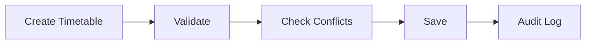

# Timetable Specification

## Overview
تمثل وحدة الجدول الدراسي المسؤول الرئيسي عن إدارة الجداول الدراسية، وتوزيع الحصص والمعلمين والفصول مع منع التعارضات.

## Business Rules
- يمنع تعارض المعلم أو الفصل أو القاعة في نفس الفترة الزمنية.
- يجب ربط كل حصة بمادة ومعلم وفصل.
- يحتفظ النظام بسجل للتعديلات على الجداول.

## Functional Requirements
- إنشاء جدول.
- تعديل الجدول.
- كشف التعارضات.
- نشر الجدول.
- البحث والطباعة.

## Non-Functional Requirements
- التحقق من التعارضات بزمن استجابة مناسب.
- تسجيل العمليات الحساسة في Audit Log.

## Data Model
- Timetable
- Session
- Teacher
- Subject
- Classroom

## API Contracts
- GET /timetables
- GET /timetables/{id}
- POST /timetables
- PUT /timetables/{id}
- DELETE /timetables/{id}

## UI Requirements
- عرض أسبوعي للجدول.
- شاشة إدارة الحصص.
- أدوات كشف التعارض.

## Acceptance Criteria
- منع التعارضات.
- حفظ الجدول بنجاح.
- تطبيق الصلاحيات.

## Mermaid Diagram
